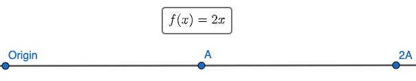
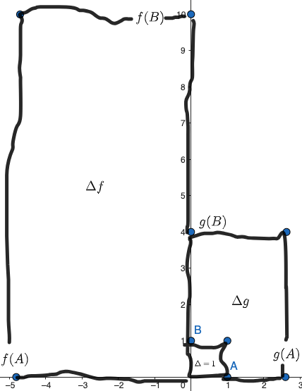

+++
author = "Someone"
title = "determinant intuition"
date = "2023-09-01"
description = "determinant-dummified"
math = true
+++

## intuition

### one-dimensions

Given two functions, $f(x)=ax$ and $g(x)=bx$, we want to compare how they transform inputs to outputs. This is simple! We just compare the coefficients. One enlarges a scalar $x$ by $a$ and another by $b$. If $a=2$, we see the transformation below.

If $a$ were zero, everything outputted would be zero and that sucks because we can't define a inverse: $f^{-1}(x)=\frac{y}{0}$. If $a$ were negative, then we would reverse the direction of every scalar.

### two-dimensions

Given two dimensional functions, let's try comparing how they transform inputs!

$$ 
f(x,y)=(ax,by),\qquad g(x,y)=(cx,dy).
$$

So if I send two basis vectors, $(1,0)$ and $(0,1)$, 

$$
f(1,0)=(a,0),\qquad f(0,1)=(b,0),\qquad g(1,0)=(c,0),\qquad g(0,1)=(0,d).
$$

Here's an example if $a$ is negative and $b,c$, and $d$ are positive. 

Now how do we compare this? There's a lot to unpack. First, let us look into the magnitude created

Notice that because $a$ is negative, we flip all of the $x$ inputs and the resulting rectangle formed by $f(A)$ and $f(B)$ is flipped about the $y$ axis. 