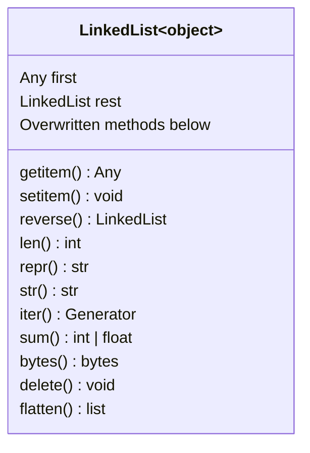

+++
author = "Someone"
title = "links"
date = "2024-01-14"
description = "linkedListLiabilities"
math = true
+++

A rough sketch for adding linked lists in Python.
<!--more-->

- [class diagram](#class-diagram)
- [result](#result)

## class diagram

Let's assume our linked list inherits from the object class. Inheriting from lists is probably a viable alternative, but I think it gets messy when considering what to do with overriding methods like `extend()` which we don't really need to support with linked lists. In the class diagram, I also list the methods we will override. In hindsight, there are a lot more methods that should be added to this list.



## result

And here's the result :). 

```python
class LinkedList(object):

    def __init__(self, first, rest=None):
        assert rest is None or isinstance(rest, LinkedList)
        self.first = first
        self.rest = rest

    def __len__(self):
        if self.rest is None:
            return 1
        return 1 + len(self.rest)

    def __repr__(self):
        return f'LinkedList({self.first}, {repr(self.rest)})'

    def __iter__(self):
        curr = self
        while curr:
            yield curr.first
            curr = curr.rest

    def __sum__(self):
        total = 0
        for val in iter(self):
            # only defined for ints/floats
            total += val
        return total

    def __bytes__(self):
        return bytes(sum(self))

    def __str__(self):
        linked_str = '<'
        curr = self
        while curr:
            linked_str += f' {curr.first} '
            curr = curr.rest
        return linked_str + '>'

    def __getitem__(self, index: int):
        assert isinstance(index, int), 'Why r u tryna slice a linked list?'
        if index < 0:
            index = len(self) + index
        for i, val in enumerate(iter(self)):
            if i == index:
                return val
        raise IndexError

    def __setitem__(self, index: int, value):
        if index < 0:
            index = len(self) + index
        curr = self
        i = 0
        while curr:
            if i == index:
                curr.first = value
                return
            curr = curr.rest
            i += 1
        if i == index:
            curr = LinkedList(value, curr)
        else:
            raise IndexError

    def __reversed__(self):
        for link in iter(self.reverse()):
            yield link

    def reverse(self):
        old_firsts = None
        curr = self.rest
        while curr:
            old_firsts = LinkedList(self.first, old_firsts)
            self = LinkedList(curr.first, old_firsts)
            curr = curr.rest
        return self

    def delete(self, index: int):
        i = 0
        curr = self
        while i < index - 1:
            try:
                curr = curr.rest
                i += 1
            except AttributionError:
                raise IndexError
        if not curr:
            raise IndexError
        curr = LinkedList(curr.rest.first, curr.rest.rest)

    def flatten(self) -> list:
        if not self:
            return []
        elif isinstance(self.first, LinkedList):
            return self.first.to_list() + self.rest.to_list()
        return [self.first] + self.rest.to_list()

```

A few comments and questions for future me:

- Do I really need all the private `__foo__()` methods and do I intend to create classes inheriting from this? (Probably not)
- Several methods are restricted to integer/float linked lists only: `__sum__()` and `__bytes__()`
  - But in fairness, `bytes()` needs an encoding if passing in strings
- When would we actually see nested linked lists in practice and should I try extending some of the methods here to support that? (Probably not that often)
- Attribute names `first` and `rest` could be swapped with `head` and `tail` which is more common I believe. (Who uses `first`...)
- Does anyone actually slice linked lists? And do we want an in-place `sort()` method? (Probably)