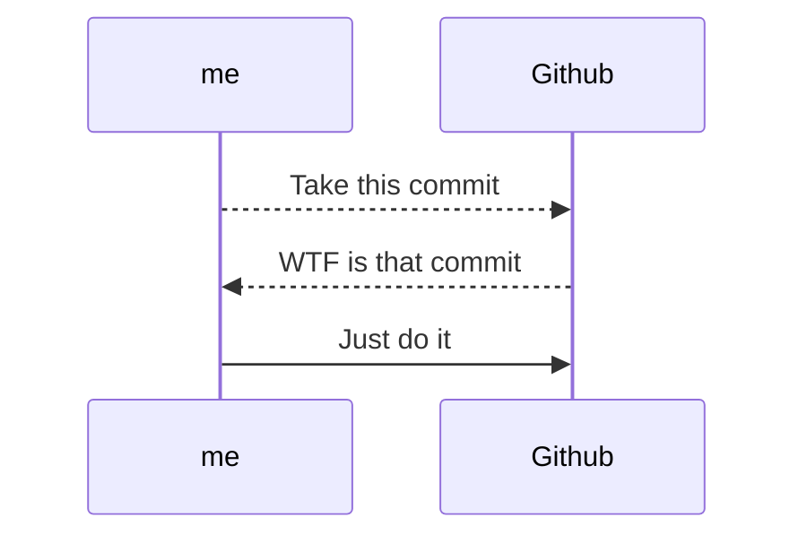

+++
author = "Someone"
title = "markdown"
date = "2023-08-25"
description = "masteringMarkdown"
math = true
+++

A overview of Markdown inspired by the [creator's post](https://daringfireball.net/projects/markdown/basics).
<!--more-->

- [heading {.unnumbered}](#heading-unnumbered)
  - [sub-heading 1](#sub-heading-1)
  - [sub-heading 2](#sub-heading-2)


# heading {.unnumbered}

- *Italics* are created with asteriks: \*phrase here\* 
- Headings are created with hashes: # phrase here
- To preview .md files in VSCode, Command + Shift + V
- **Bold** text is created with double asteriks: \*\*phrase here\*\*
- Lists, like this, are created by either a dash, -, or asterik, *
  * Nested lists are formed by indenting on the next line
- Sub-headings are created with double hashes: ## phrase here
- Checklists are created with brackets (and) an x: \[x\] phrase here \
 [ ] 100 Situps, 100 push-ups, 100 squats, and a 10-kilometer run \
 [ ] Finish the experiment and subsequent writeup on quantum stats \
 [x] Write a mediocre markdown cheatsheet with internet information 
- Sub-sub-headings are created with triple hashes: ### phrase here
- Strikethrough text are created with double tildes: \~\~ phrase here \~\~
- Quotes can be added with the character, ">", before a sentence:
> “L'harmonie la plus douce est le son de la voix de celle que l'on aime.”
>
> -- Jean de La Bruyère, Les Caractères
- Unnumbered headings are created with a `{-}` or `{.unnumbered}` after the header
- $L_a T e^X$ is supported with single dollar signs (inline) and double dollar signs (centered): 
$$f_X(x)=\frac{\beta^\alpha}{\Gamma(\alpha)}x^{\alpha -1}e^{-\beta x},\qquad x\in (0,\infty)$$
- Footnotes as here, $E=MC^2$ [^1], are created with brackets and a hyperlink at the bottom of the page: \[^1\] 
- [Hyperlinks](https://www.youtube.com/watch?v=dQw4w9WgXcQ) are created with brackets (name) and parentheses (link): \[Cat-Tutorial\](https://cats101.com)
-  are created with an exclamation point followed by the hyperlink/file path: \!\[Cat-Image\](path/to/cat/image).
- Create table of contents with Yu Zhang's "Markdown All in One" extension: Command + Shift + P + Create Table of Contents

## sub-heading 1
Lists and multi-line code blocks - add language near the first three backticks.
1. Mermaid Diagrams


2. Python Code Blocks
```python
for i in range(1, n):
    print(i**2)
```

3. R Code Blocks
```r
for (i in 1:n) {
    print(i^2)
}
```

4. There's a long list of other supported languages: Bash, Pearl, C++, Java, SQL, etc.

## sub-heading 2

Tables have quite limited support in  Markdown, but here's an example:

```
| Model | RMSE |
| ----- | ----- |
| Iterative Forest | 0.345 |
| Shallow RNN | 0.145 |
| Kernel SVM | 0.432 |
```

| Model | RMSE |
| ----- | ----- |
| Iterative Forest | 0.345 |
| Shallow RNN | 0.145 |
| Kernel SVM | 0.432 |


[^1]: [Einstein's Mass-Energy Equivalence](https://en.wikipedia.org/wiki/Mass%E2%80%93energy_equivalence)
