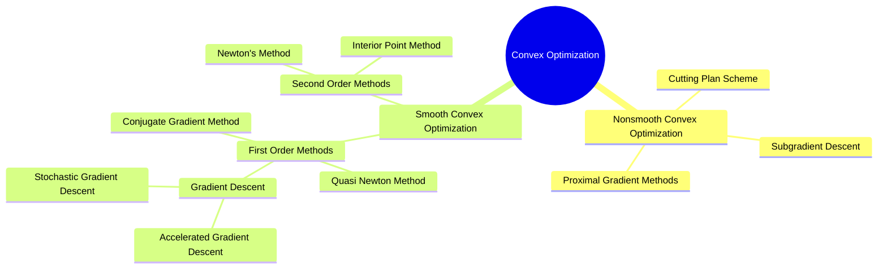
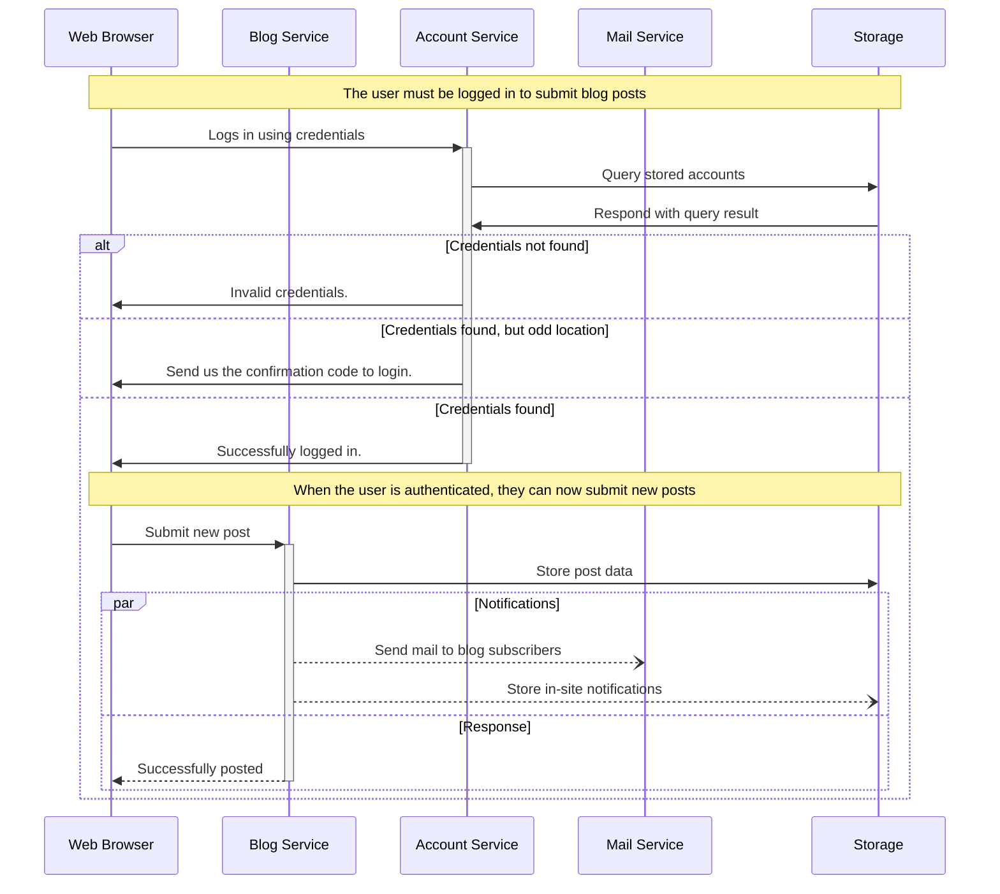
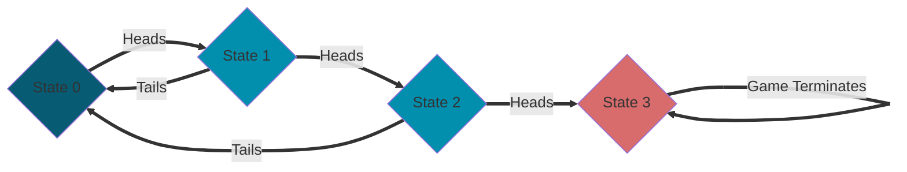
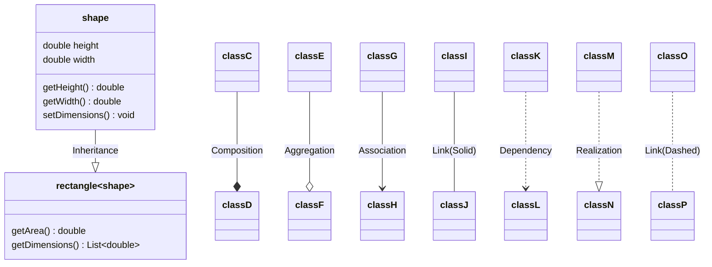
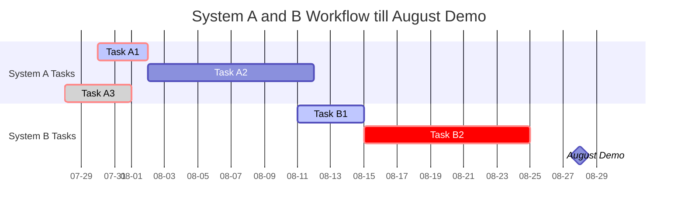

+++
author = "someone"
title = "mermaid"
date = "2023-08-25"
description = "managingMightyMermaids"
math = true
+++

Some basic Mermaid charting examples.
<!--more-->

- [mindmaps](#mindmaps)
- [sequence diagrams](#sequence-diagrams)
- [flow charts](#flow-charts)
- [class diagrams:](#class-diagrams)
- [gantt charts:](#gantt-charts)

## mindmaps 

Mindmaps are useful for organizing concepts that are hierarchical. Functionality at the moment though is quite limited. 
```
mindmap
    root((Convex Optimization))
        Nonsmooth Convex Optimization
            Proximal Gradient Methods
            Subgradient Descent
            Cutting Plan Scheme

        Smooth Convex Optimization
            First Order Methods
                Gradient Descent
                    Accelerated Gradient Descent
                    Stochastic Gradient Descent
                Conjugate Gradient Method
                Quasi Newton Method
            Second Order Methods
                Newton's Method
                Interior Point Method
```



## sequence diagrams 

Sequence diagrams are useful especially for software applications in diagramming the high-level user stories and functionalities needed for a barebone service to function.
```
sequenceDiagram
    participant web as Web Browser
    participant blog as Blog Service
    participant account as Account Service
    participant mail as Mail Service
    participant db as Storage

    Note over web,db: The user must be logged in to submit blog posts
    web->>+account: Logs in using credentials
    account->>db: Query stored accounts
    db->>account: Respond with query result

    alt Credentials not found
        account->>web: Invalid credentials.
    else Credentials found, but odd location
        account->>web: Send us the confirmation code to login. 
    else Credentials found
        account->>-web: Successfully logged in.

        Note over web,db: When the user is authenticated, they can now submit new posts
        web->>+blog: Submit new post
        blog->>db: Store post data

        par Notifications
            blog--)mail: Send mail to blog subscribers
            blog--)db: Store in-site notifications
        and Response
            blog-->>-web: Successfully posted
        end
    end
```



## flow charts 

Flow charts are similar to sequence diagrams except they are more appealing with less interactions among systems/calls. They can also be appealing for demonstrating algorithm flow and individual functionality. Orientation can be LR (left right), RL, TD (top down), and DT. 

```
flowchart LR;
    A{State 0}
    B{State 1}
    C{State 2}
    D{State 3}

    style A fill:#075B73
    style B fill:#028FAE
    style C fill:#028FAE
    style D fill:#D86C6D

    A == Heads ==> B;
    B == Tails ==> A;
    B == Heads ==> C;
    C == Tails ==> A;
    C == Heads ==> D;
    D == Game Terminates ==> D;
```



## class diagrams: 

These are useful for software engineering in identifying classes, attributes, methods, inheritence, composition, etc. These are also useful for database design - each class can be seen as a table of attributes with linkages across the various collections.
``` 
classDiagram

class shape {
    double height
    double width
    getHeight() double
    getWidth() double
    setDimensions() void
}
class rectangle~shape~{
    getArea() double
    getDimensions() List~double~
}

shape --|> rectangle : Inheritance
classC --* classD : Composition
classE --o classF : Aggregation
classG --> classH : Association
classI -- classJ : Link(Solid)
classK ..> classL : Dependency
classM ..|> classN : Realization
classO .. classP : Link(Dashed)
```



## gantt charts: 

Gantt charts are useful for illustrating schedules and time to accomplish tasks. But these are pretty painful to construct - ticketing in a gitlab, bitbucket, or another system is easier. 

```
gantt
    dateFormat              YY-MM-DD
    axisFormat              %m-%d
    title                   System A and B Workflow till August Demo

    section System A Tasks
    Task A1                 :crit, active, a1, 23-07-30, 3d
    Task A2                 :after a1, 10d
    Task A3                 :crit, done, 23-07-28, 4d

    section System B Tasks
    Task B1                 :active, b1, 23-08-11, 4d
    Task B2                 :crit, after b1, 10d

    August Demo           :milestone, m2, 23-08-26, 4d

```



More charts and examples can be found [here on Mermaid's site](https://mermaid.js.org/syntax/examples.html).