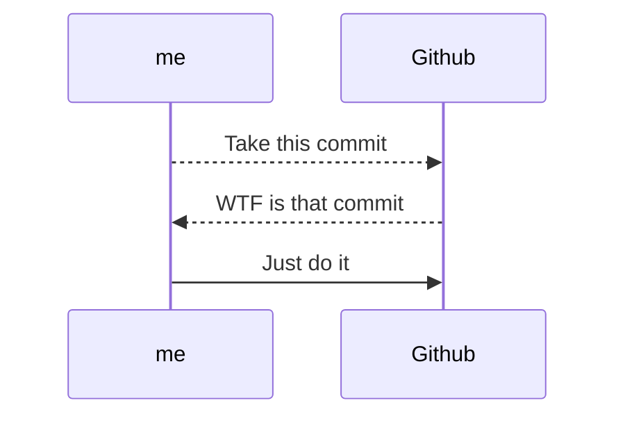

+++
author = "Someone"
title = "planningExperiments"
date = "2023-08-25"
description = "experimentalEyes"
math = true
+++

A review of Cox's book "[Planning of Experiments](https://archive.org/details/planningofexperi0000coxd)".
<!--more-->

Here's a summary of what catches my eyes in the chapters.

## preliminaries

- The book tries to capture the essence of how to plan an experiment
- Care about the relative quantities, not the absolute quantities (i.e. X > Y - workouts, diets, crop yields, etc.)
- **Experimental units** (or just units) are the plots of land, persons working out/dieting, animals, etc. being acted upon
- **Treatments** are the things we want to compare (workout A vs B, advertisement X vs Y...)

Requirements for a good experiment:

* No systematic error (comparing apples to oranges, comparing machinery at different times of day but trying to make conclusions invariant over time, cough all of finance charlatan work cough cough...)
* Precision (garbage in, garbage out) - work with tools that satisfy budget, time, etc. requirements but are precise enough to not give crappy/skewed values (classic example is any work with sensors data - huuuge problem like self-driving, climate change, etc.).
* Stress test results (i.e. obtain a good sketch of the distribution: if rainy + snowy, car accident prob = 3%... uh oh, back to drawing board)
* Simplicity: make experiments reproducible by being simple. Math is the best experiment - you just need a pen, paper, and a set of axioms. Healthcare/drugs/finance are generally the worst - expensive setups, manipulating data, incomplete stress tests, sparse units

## some key assumptions

The main assumptions for statistical analysis (according to Cox) are

> 1) observation = (quantity depending ONLY on particular unit) + (quantity depending on treatment)
He says to note that the effect is additive and not multiplicative or subtractive or any other operation. Why? I think 
$$\mathbb{E}[\text{effect}]\approx \mathbb{E}[\text{unit}]+\mathbb{E}[\text{treatment}]$$
, so when comparing differences of treatments, we have 
$$\mathbb{E}[\text{treatment difference}] = \mathbb{E}[\text{treatment 1}] - \mathbb{E}[\text{treatment 2}]$$
This is all by linearity of expectation. Had there instead been a multiplicative effect, we'd not be able to infer the treatment difference as units depend on treatments. He does note that if you somehow realized that the effects are multiplicative, you could take the log of observations to make log-linear claims... but this can get messy when doing inference I think* (but don't know)

> 2) treatment effects are constant
I do not think this is a hard requirement as we could borrow metrics in a functional space (using stochastic dominance for instance). Maybe he meant it's a random variable with some distribution $D$ that doesn't change over time, unit, etc. 
> 3) observation of one unit is not affected by treatment applied to other units
I.e. segway into double-blind experimments - we don't want people watching other people and being swayed to change the observation.


## designs for the reduction of error

The goal of the chapter is to explain how we can reduce uncontrolled variation when estimating treatment comparisons. First and foremost when conducting an experiment, envision where your variation could arise from as a set of premises. 

Here's the deal. Suppose 


## use of supplementary observatioon to reduce error

## randomization

## basic ideas about factorial experiments

## design of simple factorial experiments

## choice of number of observations

## choice of units, treatments, and observations

## more about latin squares

## incomplete factorial design

## fractional replication and confounding

## cross-over designs

## some special problems

## preliminaries


# heading {.unnumbered}

- *Italics* are created with asteriks: \*phrase here\* 
- Headings are created with hashes: # phrase here
- To preview .md files in VSCode, Command + Shift + V
- **Bold** text is created with double asteriks: \*\*phrase here\*\*
- Lists, like this, are created by either a dash, -, or asterik, *
  * Nested lists are formed by indenting on the next line
- Sub-headings are created with double hashes: ## phrase here
- Checklists are created with brackets (and) an x: \[x\] phrase here \
 [ ] 100 Situps, 100 push-ups, 100 squats, and a 10-kilometer run \
 [ ] Finish the experiment and subsequent writeup on quantum stats \
 [x] Write a mediocre markdown cheatsheet with internet information 
- Sub-sub-headings are created with triple hashes: ### phrase here
- Strikethrough text are created with double tildes: \~\~ phrase here \~\~
- Quotes can be added with the character, ">", before a sentence:
> “L'harmonie la plus douce est le son de la voix de celle que l'on aime.”
>
> -- Jean de La Bruyère, Les Caractères
- Unnumbered headings are created with a `{-}` or `{.unnumbered}` after the header
- $L_a T e^X$ is supported with single dollar signs (inline) and double dollar signs (centered): 
$$f_X(x)=\frac{\beta^\alpha}{\Gamma(\alpha)}x^{\alpha -1}e^{-\beta x},\qquad x\in (0,\infty)$$
- Footnotes as here, $E=MC^2$ [^1], are created with brackets and a hyperlink at the bottom of the page: \[^1\] 
- [Hyperlinks](https://www.youtube.com/watch?v=dQw4w9WgXcQ) are created with brackets (name) and parentheses (link): \[Cat-Tutorial\](https://cats101.com)
-  are created with an exclamation point followed by the hyperlink/file path: \!\[Cat-Image\](path/to/cat/image).
- Create table of contents with Yu Zhang's "Markdown All in One" extension: Command + Shift + P + Create Table of Contents

## sub-heading 1
Lists and multi-line code blocks - add language near the first three backticks.
1. Mermaid Diagrams


2. Python Code Blocks
```python
for i in range(1, n):
    print(i**2)
```

3. R Code Blocks
```r
for (i in 1:n) {
    print(i^2)
}
```

4. There's a long list of other supported languages: Bash, Pearl, C++, Java, SQL, etc.

## sub-heading 2

Tables have quite limited support in  Markdown, but here's an example:

```
| Model | RMSE |
| ----- | ----- |
| Iterative Forest | 0.345 |
| Shallow RNN | 0.145 |
| Kernel SVM | 0.432 |
```

| Model | RMSE |
| ----- | ----- |
| Iterative Forest | 0.345 |
| Shallow RNN | 0.145 |
| Kernel SVM | 0.432 |


[^1]: [Einstein's Mass-Energy Equivalence](https://en.wikipedia.org/wiki/Mass%E2%80%93energy_equivalence)
